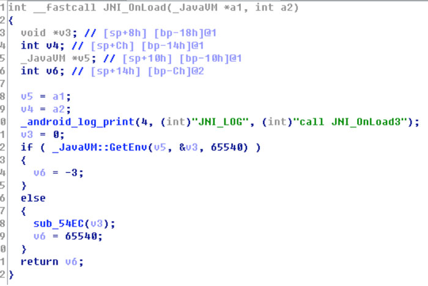
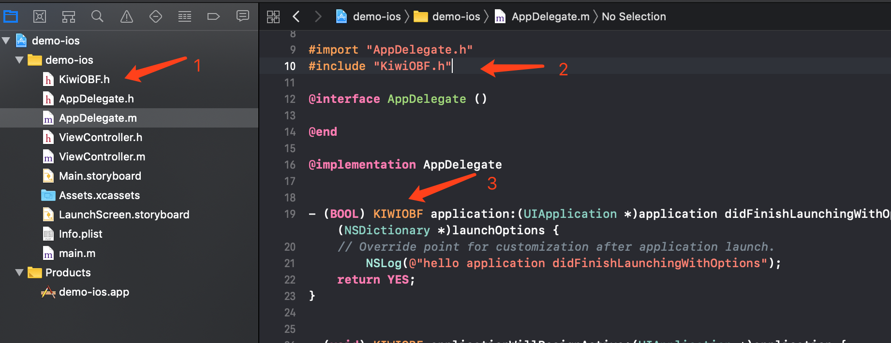

# [KiwiCompiler](https://en.kiwisec.com/product/plat-android.html)  

Source Code Encryption Tool [KiwiCompiler] is a Native source code encryption tool for Internet companies and individual developers. Similar to a normal compiler, it can compile C, C++, Objective-C, Swift and other source code into binary; however, the difference is that the security compiler can perform three security processing on the code when compiling: 1. logical confusion, deformation, expansion. 2.function call relationship encryption. 3. sensitive strings encryption. With the help of those features, the source code security will be greatly improved, preventing the attacker from decompiling the binary code through the reverse tool such as IDA Pro to tamper or steal the core technology.
 
## Features and Advantages
* **Code Obfuscation:** Protect code from expansion, confusion. To prevent reverse analysis by IDA Pro.
* **String Encryption:** Encryption of sensitive strings to prevent attackers from locating core code through keywords.
* **Multi-Language:** Support for obfuscation protection of C, C++, Objective-C, Swift codes.
* **Easy to Use:** Android studio plug-in mode, the same as the original compilation process.

## Functional Description
### 1.Code Obfuscation
Using code warping, code bloat, logic obfuscation at compile stage,can prevent the crack analysis of reverse tools such as IDA Pro

* View the function flow chart of **unencrypted** in IDA Pro


* View the function flow chart of **encrypted** in IDA Pro


### 2.Block Scheduling
Encrypting code references and function calls during the compilation phase can realize function logic hiding and function logic chain breaking, and can prevent static analysis of reverse tools such as IDA Pro.
* Decompile **unencrypted** function in IDA Pro 



* Using Ida Pro to decompile the **encrypted** function will fail because the function call relationship is replaced.


### 3.String Encryption
Encrypting sensitive string data to prevent attackers from using keyword search to locate key codes, increasing reverse difficulty
* View **unencrypted** string in IDA Pro


* View **encrypted** string in IDA Pro    


## Documentation

You can find the KiwiVM documentation [on the website](https://document.kiwisec.com/en/kiwiVM).  

#### 1. Obtain
After purchasing the KiwiCompiler, use the machine code generation tool, provided by the KiwiSec to extract the key of the computer to be bound. It will generate a unique KiwiCompiler toolkit based on the Key, authorization time, and enterprise information.

#### 2. Install
Plug-in version can be seamlessly integrated into the development environment by executing Python installation script, automatically replacing Xcode or NDK's original compiler [clang], without changing the development and compilation process of the project, thus reducing the cost of learning and using the product:

>Xcode plug-in executes the Xcode file. The tool will automatically replace the default Xcode compiler, start the Xcode development tool, and automatically restore the original compiler after exit.

#### 3. Header File
Copy the header files in the include directory to the iOS and NDK projects, reference them where needed.

#### 4. Add KIWIOBF Tag
Add KIWIOBF tag to functions that need to be protected by confuse, to tell the compiler that the function needs to be protected by confuse. As shown below:


#### 5. Setting Compilation Parameters
The security compiler has default obfuscation parameters and can customize configuration parameters if the requirements are not met.

Parameters that:

| parameter | effect | description |   
| - | :-: | -: | 
| -kce-fla | transverse expansion | Separate each basic block and use switch statment to control the running process. <br/>**The value range is 0 ~ 5, and the default value is 1** |
| -kce-fla-chance | transverse expansion ratio | Random encryption is performed for functions that have not set labels or are not checked. If only the functions of tags are encrypted, 0 can be set<br/> **The value range is 0 ~ 100, and the default value is 15**  |
| -kce-bcf | longitudinal expansion | Copy the basic block in the original equation and mix in useless instructions. Add conditional transfer instructions at the beginning of the equation and become multiple basic block branches. <br/>**The value range is 0 ~ 5, and the default value is 1** |
| -kce-bcf-prob | Longitudinal expansion of the base block proportions | Each encryption randomly overrides the proportion of the base block <br/> **The value range is 0 ~ 100, and the default value is 15**|
| -kce-bcf-chance | Longitudinal expansion function proportions|  Random encryption is carried out for functions that have not set labels or are not checked. If only the functions of tags are encrypted, 0 can be set. <br/> **The value range is 0 ~ 100, and the default value is 15**|
| -kce-mbs | Lightweight virtualization | Lightweight virtualization switch, without changing the original logic, to replace the program basic block jump, function call for indirect jump, prevent static analysis of the target program<small>*[Only the professional edition does]*</small><br/>**The default open** |
| -kce-str | String encryption | Encrypts and protects the plaintext string in the project.<br/>**The default open**  |
| -kce-use-unity | Unity project | If you are a Unity project, you must open it.<small>-kce-use-unity=1</small><br/>**The default close** |

>Note: the larger the parameter, the longer the compilation time, and the higher the package expansion; It is recommended to set reasonable parameters

Confusing parameters for iOS projects are set in Other C Flags,Other C++ Flags


#### 6. Build
The project compilation operation is the same as the original process. The iOS project executes the Build in Xcode.
#### 7. Uninstall plugins
a.execute ```sudo uninstall.sh or python setup. py --clang=/path/to/clang --uninstall``` script to automatically restore the original compiler


## Kiwisec
Relying on the technical advantages of the team, KiwiSec focuses on next-generation technology and product development in mobile safety. After 8 years of accumulation in compiler security technology, and 3 years’ continuous research and development, the original KiwiVM virtual machine product has completely solved the problems of weak protection and poor compatibility inherent in traditional technologies such as hardening and obfuscation, providing a convenient and effective security solution.

[Learn more](https://en.kiwisec.com)
